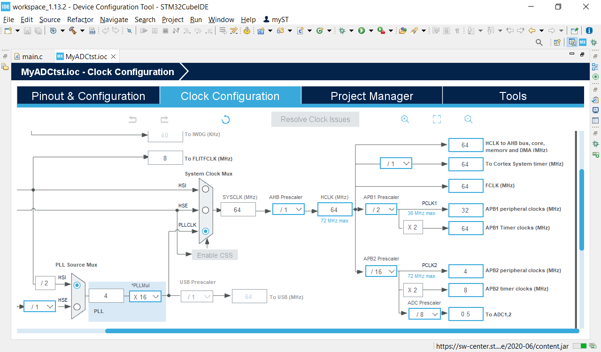
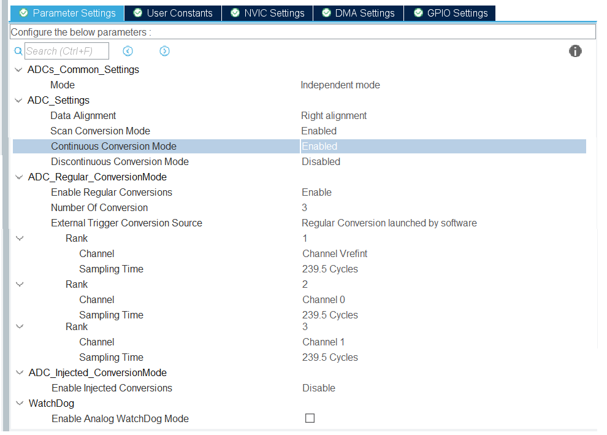
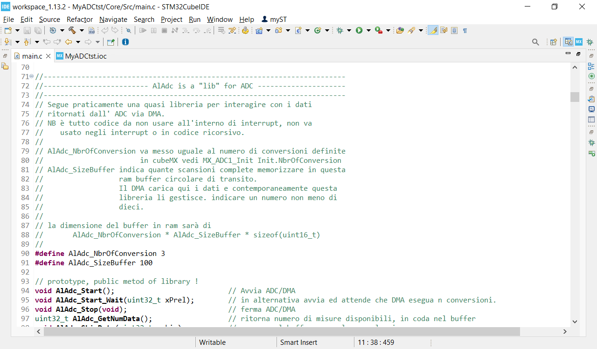

# STM32AlAdc
AlAdc is a "lib" for ADC of STM32F103 processor and later.

L'idea su cui si basa il funzionamento è il seguente.
ADC con DMA vengono inpostati per lavorare in background senza generare interrup
e caricano i dati in un buffer circolare, senza mai smettere.

Questa libreria accede al buffer circolare per leggere i dati caricati.
Cuore del sistema è il registro hdma_adc1.Instance->CNDTR che consente alla libreria
di accedere direttamente all'ultimo valore che il DMA ha caricato nel buffer.

Non si tratta di una vera e propria libreria bensi di "semplice" codice da copiaincollare
nel vostro progetto.

La libreria viene fornita assieme al codice di test e di sample.

Allego anche le immagini con le impostazioni che ho eseguito in STM32CubeMX
Ovviamente i canali adc e i rank e le velocita ecc sono puramente di esempio.

Oltre al copiaincolla del codice dovrete, potete impostare le due define
AlAdc_NbrOfConversion e AlAdc_SizeBuffer

Naturalmente imposterete velocità piu elevate, ho impostato cosi lento per
sviluppo e test.

I canali/rank li imposterete in base al vostro progetto, l'idea della
libreria è che rimangano comunque fissi non impostabili a runtime ma solo
a design time. Attenzione number of conversion deve corrispondere alla
define AlAdc_NbrOfConversion
ovviamente canali regolari non injected conversion.

Questa è solo un immagine per il codice effettivo vedi la cartella
Core/Src/main.c

